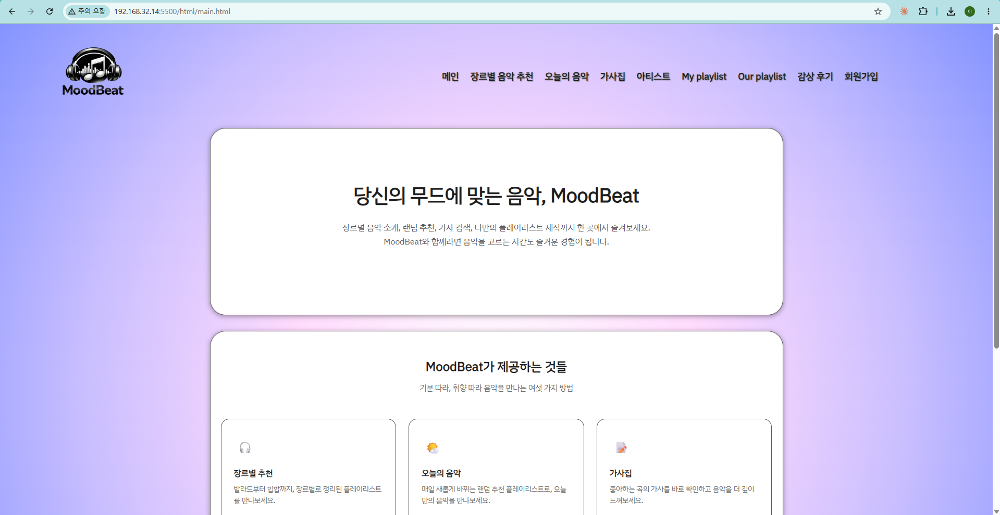

# 무드비트 - 음악 플레이리스트 추천 사이트 제작
## 1. 프로젝트 소개 및 설정 이유
이 프로젝트는 무드비트 - 음악 플레이리스트 추천 사이트 소개하기 위한 웹페이지를 제작하는 것으로, 웹 개발의 기본 요소를 학습하고 협업을 어떤 식으로 진행하는지 배우기 위해 진행되었다. JavaScript를 활용해 페이지의 동적 효과를 구현했다.

-메인 이미지

## 2. 사용 기술
이 프로젝트에 사용된 기술은 다음과 같다.
- HTML5
- CSS3
- JavaScript
- Git
- GitHub

## 3. 팀원 역할
각 팀원이 맡은 역할은 다음과 같다.

|맡은 페이지 | 이름 |
|---|---|
| 메인 페이지(header, footer) | 초이 |
| 장르별 음악 소개 | 초이 |
| 오늘의 음악 | 정우 |
| 가사집 | 서현 |
| 아티스트 | 정우 |
| My playlist | 서현 |
| Our playlist | 서현 |
|감상후기 | 정우 |
| 회원가입 | 초이 |

## 4. 핵심 기술
협업을 위해 브랜치를 이용해 각자의 작업을 동시적으로 진행하였다. 맡은 페이지 규모가 작아 자신의 이름으로 브랜치를 만들고 그 안에 페이지를 작성하였다.
프로젝트의 깃허브 주소는 다음과 같다: 

[GitHub web-team-project](https://github.com/choyi96/team-playlist.git)

## 5. 설정
공통으로 사용한 색상 코드와 폰트는 다음과 같다.

### 색상 코드
#6367FF
#8494FF
#C9BEFF
#FFDBFD

### 폰트
한글-IBM Plex Sans KR | 영어-Kanit